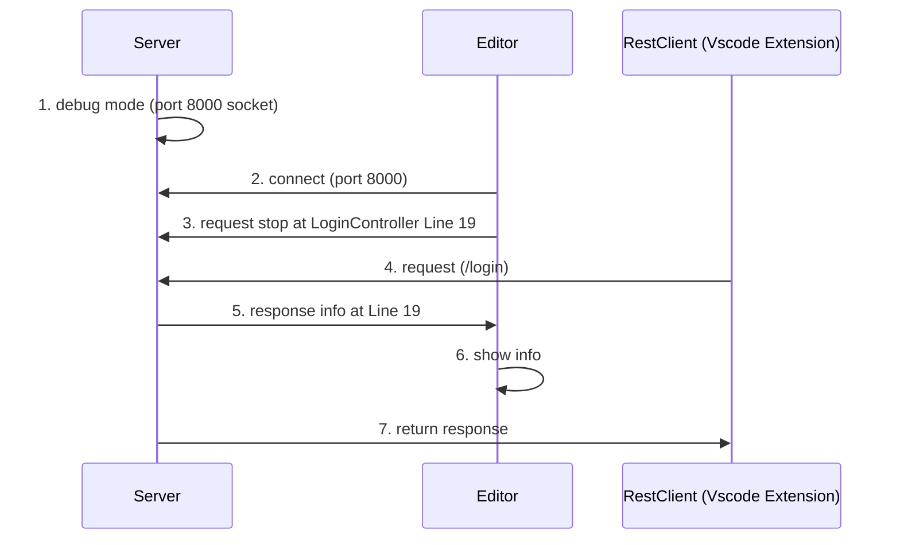

# Debug Flow

# Introoduction

-  `export JPDA_ADDRESS=8000 `
-  `export JPDA_TRANSPORT=dt_socket `
- `cd $TOMCAT_HOME/bin`
-  `./catalina.sh jpda start `
-  launch.jsonで実行

- `sudo systemctl start postgresql`