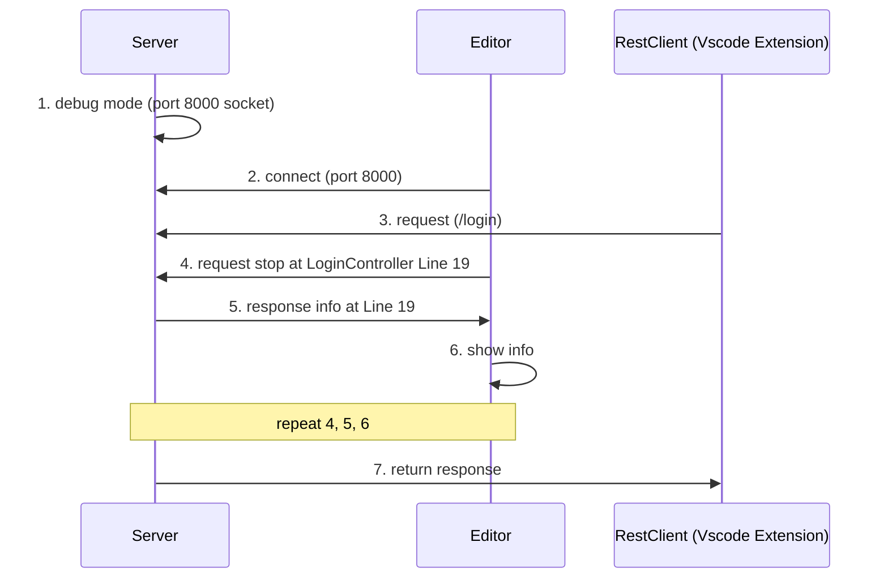

# Debug Flow

# Introoduction

-  デプロイする
-  別ターミナルを出す
-  `export JPDA_ADDRESS=8000 `
-  `export JPDA_TRANSPORT=dt_socket `
-  `cd $TOMCAT_HOME/bin`
-  `./catalina.sh stop `
-  `./catalina.sh jpda start `
-  Ctrl + Shift + D -> 緑(Start Debugging)でデバッグ開始(Debug Attach)
-  login.httpのリクエストを送る

- `sudo systemctl start postgresql`

# reference 
- [vscode debug](https://qiita.com/a__i__r/items/5a9a65195fe82cebd25b)
- [How to start debug mode from command prompt for apache tomcat server?](https://stackoverflow.com/questions/16689274/how-to-start-debug-mode-from-command-prompt-for-apache-tomcat-server#comment24017695_16689274)