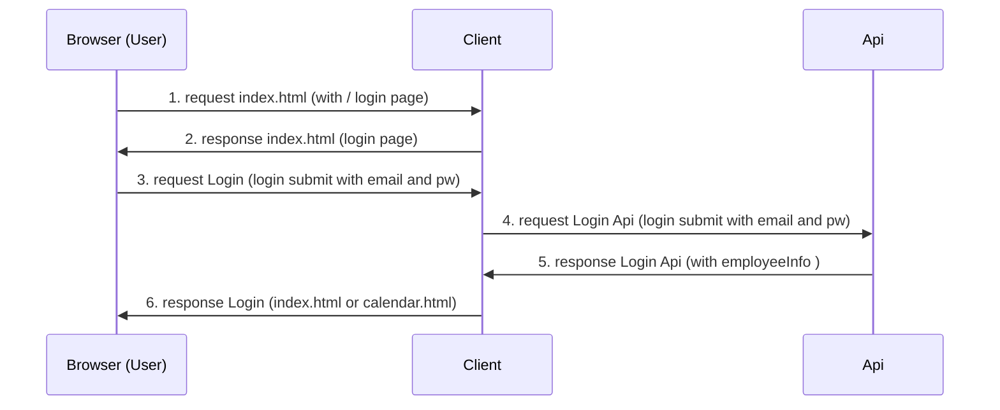

# clinet-side

# project construction
```
.
├── pom.xml
└── src
    ├── main
    │   ├── java
    │   │   └── com
    │   │       └── koko
    │   │           ├── controllers
    │   │           │   └── LoginController.java
    │   │           └──...
    │   ├── resources
    │   └── webapp ← ここがTomcatプロジェクトにおいて必要
    │       └── WEB-INF
    │           └── web.xml
    └── test
        └── java

```
# ざっくりフロー
- user
    - http://localhost:8080/をBrowserで
- client
    - index.htmlを返却
- user 
    - email pw を入力
    - submit `http://localhost:8080/call-login`
- client
    - requestを受け取る
    - email pw をサーバサイドにリクエスト `http://localhost:8080/login`
- api
    - requestを受け取る
    - 認証処理
    - responseをclientに返却(json -> javaのクラスをjava以外でも使えるようにするため ex:フロントエンド)
- client
    - responseから成功か否か判定
        - 成功
            - session にemployeeIdを詰め込む
            - カレンダー画面
        - 失敗
            - ログイン画面 + メッセージ表示
    - 描画したHTMLを返却
- user
    - 画面みえた！！
    
## sequence diagram



# Thymeleaf or JSP
- JSP ← こいつ決めた！！
    - 今のあるJSPをそのまま流用できそう
    - 古技術より勉強する最初のものとしてはよさげ
    - javaのコードでHTMLをレンダリングできる
        - 学習コストとしては割と少ない
- Thymeleaf
    - 今も割と使用されている
    - Javaのコードは基本使わく,htmlタグの属性でFor文を回したりする
        - もしJSでReactとかにFrontend移行になった場合、移行作業がやりやすい
    - javaを未使用より割ときれいにかける
    - ...

# design

### GET `/employees` 

#### Request Query Parameters

| Name  | Type   | Nullable | Description                        |
|-------|--------|----------|------------------------------------|
| email | String | false     |   |
| password | String | false     |   |

#### Responses Parameters

###### Success (200)

| Name               | Type    | Nullable | Description                                                |
|--------------------|---------|----------|------------------------------------------------------------|
| employeeId       | String  | false    |  |
| employeeName         | String | false    |  |
| email | String | false    |  |
| role | String | false    |  |

### 理由