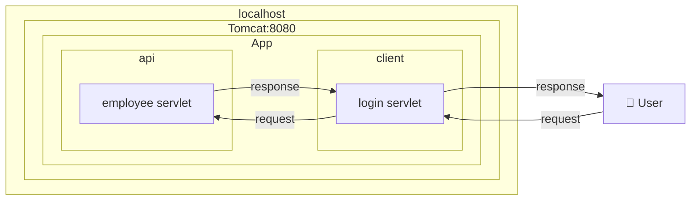
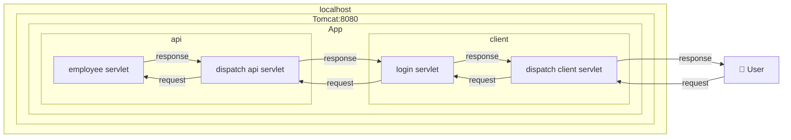

# spring-framework

## dependecy
- spring-core ← Springframeworkを使用する中心的な部分 ← 共通部品
- spring-context ← DIをするための箱
- spring-beans ← 箱に詰めるInstance
- spring-aop ← AOPで使用する
- spring-webmvc ← WebはWebでもリクエストとレスポンスを上手いことする Controller的なもので使用
- spring-web ← Front側で主に使用されるWeb関連
- spring-expression ← 知らない

## What is Servlet?

## Tomcat only

## Tomcat with spring framework

